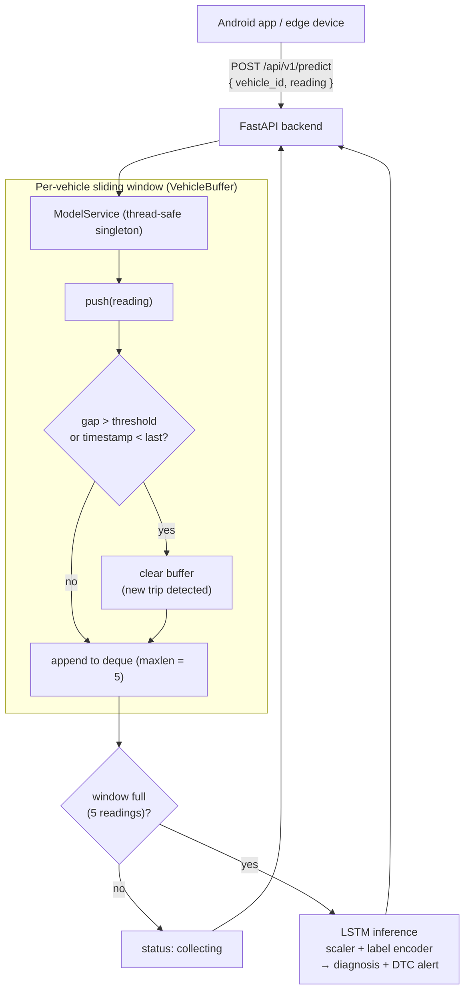

<div align="center">

# Intelligent Vehicle Fault Diagnosis Engine

### Stateful temporal LSTM over streaming OBD-II sensor data

[](https://python.org)
[](https://tensorflow.org)
[](https://fastapi.tiangolo.com)
[](LICENSE)

**An end-to-end MLOps engine that turns a stream of OBD-II sensor readings into real-time predictive-maintenance diagnoses — using a stateful LSTM and a per-vehicle sliding-window inference service.**

</div>

---

## From Snapshot Classifier to Temporal Model

This repo captures a deliberate architecture evolution:

| Phase | Approach | Limitation / Outcome |
|---|---|---|
| **1 — Baseline** (`notebooks/RF_Baseline_Cascade.ipynb`) | Random Forest cascade: a binary "gatekeeper" (normal/faulty) feeding a multi-class specialist for the specific OBD-II error code | Effective on tabular snapshots, but blind to how components degrade *over time* |
| **2 — Production** (`notebooks/LSTM_Comp.ipynb`) | Stateful LSTM over sequential readings | Captures the trajectory of thermal stress and RPM/speed ratios across a trip — **this powers the backend** |

---

## Real-Time Serving Architecture



### Stateful Sliding-Window Inference

The `model_service.py` (verified) implements a thread-safe `ModelService` singleton owning one `VehicleBuffer` (a `deque(maxlen=TIME_STEPS)`) per `vehicle_id`:

- **Sliding window** — needs 5 consecutive readings to form a sequence; each new reading slides the window forward for continuous monitoring.
- **Trip-boundary detection** — if a reading arrives after a large time gap **or with a backwards timestamp**, the buffer resets (a new trip has begun), preventing cross-trip contamination.
- **DTC alert mapping** — diagnoses map to human-readable OBD-II error alerts.

---

## API

**`POST /api/v1/predict`**

```json
{
  "vehicle_id": "VIN-ABC123",
  "reading": {
    "ENGINE_RPM": 1200.0,
    "SPEED": 40.0,
    "ENGINE_COOLANT_TEMP": 88.0,
    "timestamp_ms": 1700000060000
  }
}
```

Returns `collecting` until the window fills, then `ready` with the diagnosis. Health check at `GET /api/v1/health`.

---

## Running Locally

```bash
git clone https://github.com/YazanAi-Dev3/Vehicle-Fault-Diagnosis-Engine.git
cd Vehicle-Fault-Diagnosis-Engine
pip install -r requirements.txt

# Train via notebooks/LSTM_Comp.ipynb, save .keras/.h5 + encoders to deployment_assets/
uvicorn api.main:app --host 0.0.0.0 --port 8000
```

> Heavy artifacts (`.h5`, `.keras`, `.joblib`, raw CSV/JSON datasets) are intentionally excluded from version control.

---

## Tech Stack

| Layer | Technology |
|---|---|
| Deep Learning | TensorFlow / Keras (LSTM) |
| Classical ML | scikit-learn, Pandas, NumPy |
| Backend | FastAPI, Pydantic, Uvicorn |

---

## License

MIT.
